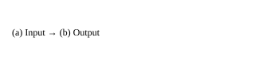

import ResponsiveTable from '@/components/ResponsiveTable.astro';
import AcademicCallout from '@/components/AcademicCallout.astro';

本文是合成测试样例。Synthetic fixture — not a scientific publication 仅展示两个条件的比较结构，不能证明实际性能改进。

## 这篇论文解决什么问题？

该合成样例仅展示比较结构；没有实测数据，无法据此推断科学结论。

## 研究思路是什么？

该合成样例仅展示比较结构；没有实测数据，无法据此推断科学结论。

## Figure 1：比较如何组织

<figure>
  
  <figcaption>Figure 1：图中的输入与输出展示比较结构，没有测量结果。</figcaption>
</figure>

问题：示意图中的输入、输出如何对应？

读图方法：先读 panel a 的输入，再沿箭头读 panel b 的输出；这里没有数值坐标轴。

核心观察：图中只给出两个标签及其顺序，没有误差、样本量或效应测量。

支持判断：该合成样例仅展示比较结构；没有实测数据，无法据此推断科学结论。（C01）。

证据边界：该合成样例仅展示比较结构；没有实测数据，无法据此推断科学结论。

## Table 1：两个条件的对应关系

Table 1：表格列出两个条件及其标签，不能用于推断性能。

<ResponsiveTable>

| 条件 | 说明 |
| --- | --- |
| A | 输入 |
| B | 输出 |

</ResponsiveTable>

问题：两个条件各自承担什么角色？

读表方法：第一列是条件标记，第二列是其角色；逐行对照 A 和 B。

核心观察：A 对应输入，B 对应输出；表格没有报告定量性能。

支持判断：该合成样例仅展示比较结构；没有实测数据，无法据此推断科学结论。（C01）。

证据边界：该合成样例仅展示比较结构；没有实测数据，无法据此推断科学结论。

## 作者真正证明了什么？

该合成样例仅展示比较结构；没有实测数据，无法据此推断科学结论。

## 创新点在哪里？

该合成样例仅展示比较结构；没有实测数据，无法据此推断科学结论。

## 哪些结论证据仍然不足？

该合成样例仅展示比较结构；没有实测数据，无法据此推断科学结论。

## 这项工作有哪些局限？

<AcademicCallout kind="caution" label="证据边界">
该合成样例仅展示比较结构；没有实测数据，无法据此推断科学结论。
</AcademicCallout>

## 对我的研究有什么可迁移价值？

该合成样例仅展示比较结构；没有实测数据，无法据此推断科学结论。

## 参考文献

Synthetic fixture — not a scientific publication. 测试样例，无真实论文或 DOI。
